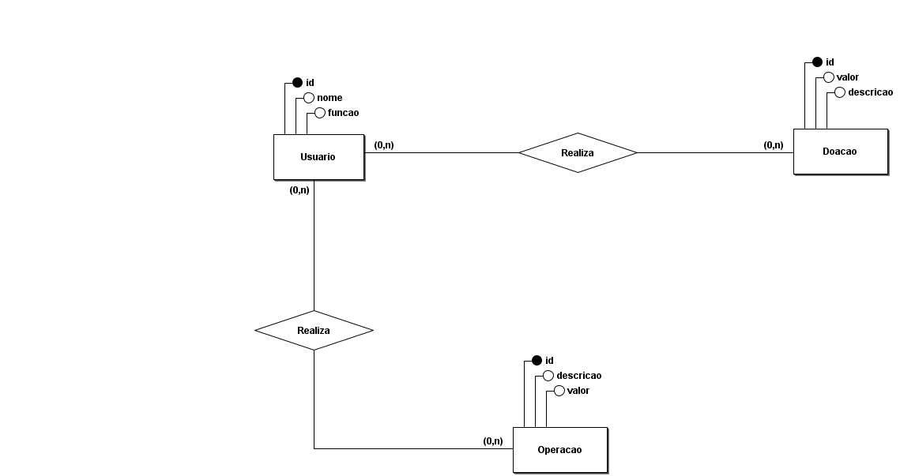
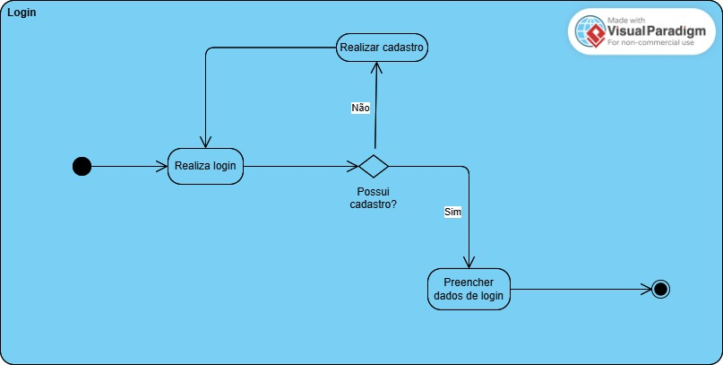
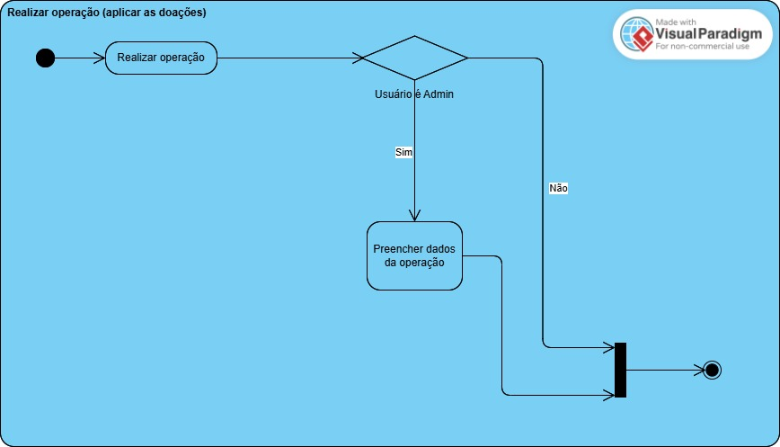

# ads-praticas-extensionistas-3-2025

### Participantes

> Luis Carlos Becker (conta.becker@gmail.com)

> Paulo Luis Hammes (paulolb03@gmail.com)

> Vitor Mateus Weirich (weirichvitor@gmail.com)

### Projeto

- Um sistema WEB de doações visando apoia a comunidade.

Com os requisitos básicos de:

1. Cadastro de usuários (doadores e admins)
2. Um 'portal' para visualizar as campanhas de doação em curso
3. Um página de transparência (onde está sendo alocados as doações)

### Diagramas

#### Entidade Relacionamento

#### Atividade

##### Realizar login

##### Realizar operação

