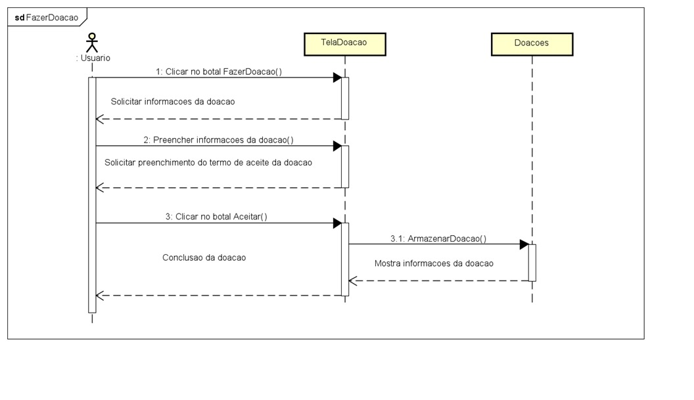

# ads-praticas-extensionistas-3-2025

### Participantes

> Luis Carlos Becker (conta.becker@gmail.com)

> Paulo Luis Hammes (paulolb03@gmail.com)

> Vitor Mateus Weirich (weirichvitor@gmail.com)

### Projeto

- Um sistema WEB de doações visando apoiar a comunidade.

Com os requisitos básicos de:

1. Cadastro de usuários (doadores e admins)
2. Um 'portal' para visualizar as campanhas de doação em curso
3. Um página de transparência (onde está sendo alocados as doações)

### Link do gitHub

[ads-praticas-extensionistas-3-2025](https://github.com/vitorweirich/ads-praticas-extensionistas-3-2025)

### Diagramas

#### Entidade Relacionamento

#### Atividade

##### Realizar login

##### Realizar operação

#### Diagrama de caso de uso

#### Diagrama de classes

### Diagramas de sequência

#### Visitante

#### Usuario

#### Fazer Doação

#### Tela de Doações

#### Comentários

## Modelagem e DDL do Banco de Dados

A modelagem do banco de dados foi realizada com base nos requisitos do sistema, utilizando o modelo entidade-relacionamento para definir as principais entidades e seus relacionamentos. A estrutura do banco foi implementada em PostgreSQL, e os scripts de criação das tabelas e relacionamentos estão disponíveis na pasta `./modelagem-banco-de-dados`.

Arquivos disponíveis:

- `modelagem-banco-de-dados/DDL.sql`: Script de criação das tabelas e constraints do banco.
- `modelagem-banco-de-dados/init.script.sql`: Script de inicialização e inserção de dados exemplo.
- `modelagem-banco-de-dados/relacionamento-entidades.jpeg`: Imagem do diagrama de relacionamento das entidades.

## Codigo Fonte do sistema

O sistema possui uma arquitetura cliente-servidor, com backend em Java Spring Boot, banco de dados PostgreSQL e frontend em Vue.js.
Para mais detalhes veja o README.md no caminho `./sistema-doacoes-completo/README.md`, juntamente como todo o codigo fonte que é separado em pastas.

- Frontend: `./sistema-doacoes-completo/frontend`
- Backend: `./sistema-doacoes-completo/backend`

## Práticas Extensionistas IV

Documentação específica da disciplina (diagramas de arquitetura, DevOps, escolha de infraestrutura e justificativas) está consolidada em:

`./praticas-IV/README.MD`

Link direto no GitHub: [Práticas Extensionistas IV – Entrega 1](praticas-IV/README.MD)

Conteúdos presentes:

- Diagrama de Pacotes (Arquitetura da Aplicação)
- Diagrama de Implantação
- Diagrama de Arquitetura DevOps (CI/CD)
- Justificativa da infraestrutura (Self-host em VPS com Coolify/Dokploy) e plano de evolução
