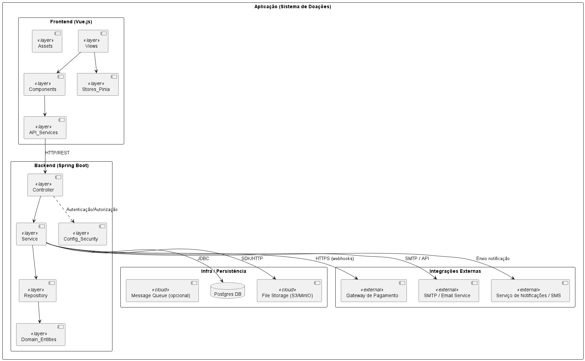
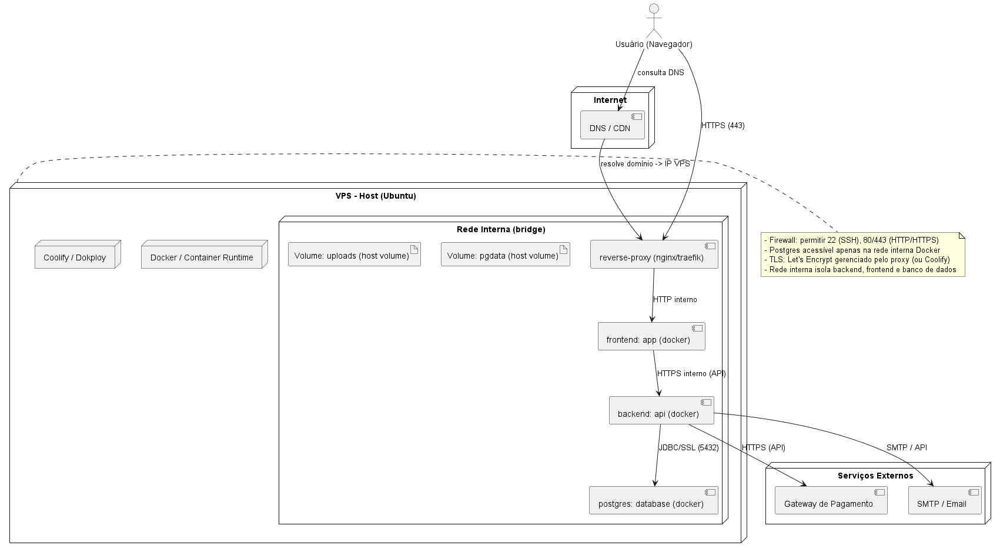
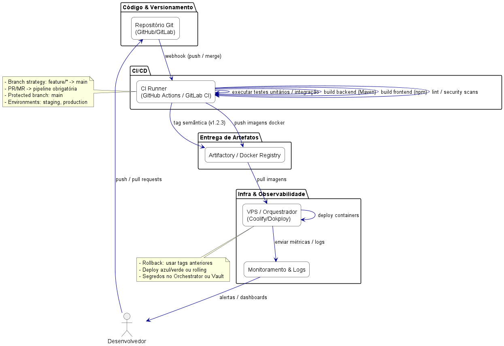

# Práticas Extensionistas IV – Entrega Parcial (Entrega 1)

## 1. Integrantes do Grupo

| Nome                 | E-mail                 |
| -------------------- | ---------------------- |
| Luis Carlos Becker   | conta.becker@gmail.com |
| Vitor Mateus Weirich | weirichvitor@gmail.com |

## 2. Repositório do Projeto

Repositório GitHub: https://github.com/vitorweirich/ads-praticas-extensionistas-3-2025

## 3. Contexto do Sistema

O projeto é um sistema web para gerenciamento e divulgação de campanhas de doações, permitindo:

1. Cadastro e autenticação de usuários (doadores e administradores)
2. Visualização pública (portal) de campanhas ativas
3. Página de transparência para acompanhamento do destino das doações

Arquitetura tecnológica (stack atual):

- Backend: Java Spring Boot (API REST)
- Frontend: Vue.js (SPA)
- Banco de Dados: PostgreSQL
- Containerização: Docker / Docker Compose
- Reverse Proxy / Static Serving: Nginx (para frontend em produção)

> Observação: Os arquivos .puml estão versionados para garantir rastreabilidade e permitir evolução incremental.

## 4. Diagrama UML de Pacotes (Arquitetura da Aplicação)

Arquivo fonte (PlantUML): `diagramas/Diagrama 1 - Diagrama de Pacotes (Arquitetura da Aplicação).puml`

## 5. Diagrama de Arquitetura de Implantação (Deployment)

Arquivo fonte: `diagramas/Diagrama 2 - Diagrama de Implantação (Deployment).puml`

## 6. Diagrama de Arquitetura DevOps (CI/CD)

Arquivo fonte: `diagramas/Diagrama 3 - Diagrama de Arquitetura DevOps (CI-CD).puml`

## 7. Escolha da Infraestrutura e Justificativa (Self-Host em VPS)

Decisão adotada: **Self-host em uma VPS (Ubuntu) utilizando uma camada de orquestração simplificada com Coolify ou Dokploy** para gerenciar containers Docker do frontend, backend e banco de dados PostgreSQL.

### Motivação da escolha

Optamos por self-host porque oferece equilíbrio entre custo, flexibilidade e aprendizado prático de operação. Ferramentas como **Coolify** e **Dokploy** fornecem uma experiência semelhante a PaaS (deploy via Git, HTTPS automático, gestão de variáveis e logs) sem o bloqueio de fornecedor e com custo previsível (apenas a VPS + armazenamento).

### Comparação Resumida

| Critério / Aspecto | Self-Host (VPS + Coolify/Dokploy) | PaaS (Render / Railway / Heroku) | Nuvem Escalável (AWS)                            |
| ------------------ | --------------------------------- | -------------------------------- | ------------------------------------------------ |
| Custo inicial      | Baixo e fixo (1 VPS)              | Baixo / gratuito limitado        | Variável (pay-as-you-go)                         |
| Controle           | Alto (rede, SO, tunning)          | Médio (restrições de runtime)    | Muito alto                                       |
| Facilidade inicial | Média (configuração inicial)      | Alta (deploy imediato)           | Baixa/Média (infra IaC)                          |
| Automação deploy   | Webhooks + pipelines custom       | Integrado                        | Necessário configurar (CodeBuild, Actions, etc.) |
| Escalabilidade     | Limitada ao tamanho da VPS        | Escala moderada automática       | Alta (ECS/EKS/ASG)                               |
| Observabilidade    | Básica (logs/metrics via agentes) | Básica → Moderada                | Ampla (CloudWatch, X-Ray)                        |
| Custos ocultos     | Baixos (upgrade manual)           | Possível após exceder limites    | Pode crescer rapidamente                         |
| Aprendizado DevOps | Elevado (controle ponta a ponta)  | Menor (abstraído)                | Elevado (mais serviços)                          |
| Vendor lock-in     | Muito baixo                       | Médio                            | Médio/Alto (serviços gerenciados)                |

### Como será estruturado

- **Camada de entrada**: Proxy reverso (Traefik ou Nginx) gerenciado pela própria plataforma (Coolify/Dokploy) com certificados TLS (Let's Encrypt)
- **Containers**: `frontend` (Nginx servindo build Vue), `backend` (Spring Boot), `postgres` (com volume persistente) e `uploads`
- **Rede interna**: Bridge isolando banco e backend do acesso externo direto
- **Deploy**: GitHub Actions (build & push imagens) + webhook / API de atualização da plataforma
- **Backups**: Dump periódico do Postgres + cópia dos volumes de uploads

### Por que ainda considerar AWS no futuro?

- Necessidade de escalar horizontalmente (ex.: muitas campanhas simultâneas)
- Requisitos avançados de observabilidade, compliance e segurança
- Integração com serviços gerenciados (S3 para mídia, CloudFront CDN, SQS para filas, Cognito ou IAM para autenticação mais robusta)

### Boas práticas usando VPS

- Firewall: expor apenas 22 (SSH - restrito), 80/443 (HTTP/HTTPS)
- TLS automático via Let's Encrypt renovado pela plataforma
- Variáveis de ambiente para segredos (nenhum segredo commitado)
- Usuário não-root nos containers de aplicação
- Atualizações periódicas do SO e dependências
